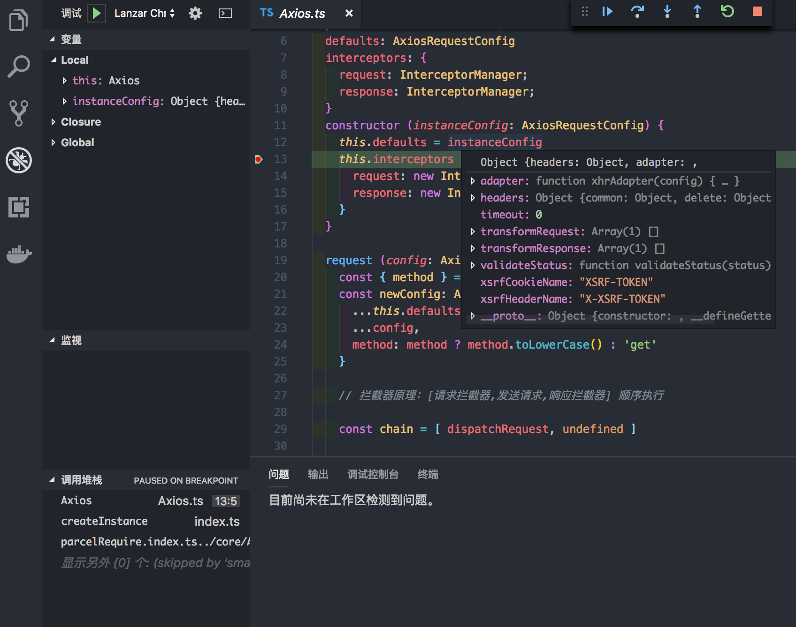
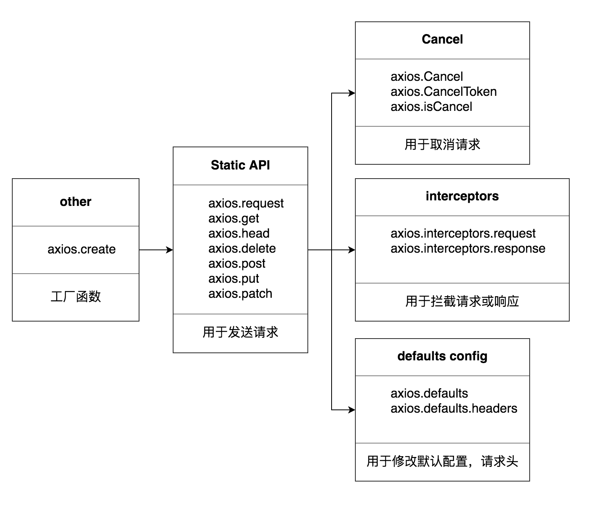
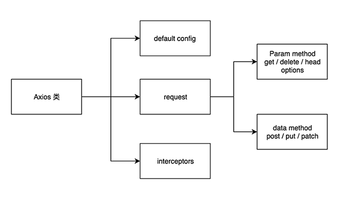

# TypeScript 重构 Axios 全攻略

又是一篇关于 TypeScript 的分享，年底了，请允许我沉淀一下。上次用 TypeScript 重构 Vconsole 的[项目](https://juejin.im/post/5bf278295188252e89668ed2) 埋下了对 [Axios](https://github.com/axios/axios) 源码解析的梗。于是，这次分享的主题就是 **如何从零用 TypeScript 重构 Axios 以及为什么我要这么做**。

笔者在用 TypeScript 重复造轮子的时候目的还是很明确的，**不仅是为了用 TypeScript 养成一种好的开发习惯，更重要的是了解工具库关联的基础知识。** 只有更多地注重基础知识，才能早日摆脱文档工程师的困扰。(Ps: 用 TypeScript，也是为了摆脱前端查文档的宿命!)

本次分享包括以下内容：

- 工程简介
- API 实现
- 设计模式的应用
- XHR，XHR，XHR
- HTTP，HTTP，HTTP
- 单元测试

## 工程简介

Axios 是什么?

> Promise based HTTP client for the browser and node.js

Axios 支持浏览器和 Node。这里主要讲解浏览器端的 XHR 实现，限于篇幅不会涉及 node 下的 http 。用 TypeScript 实现还是很简单的，来一起探索吧！

### 目录说明

首先来看下目录。


目录与 Axios 基本保持一致，core 是 `Axios` 类的核心代码。adapters 是 XHR 核心实现，Cancel 是与 取消请求相关的代码。helpers 用于放常用的工具函数。`Karma.conf.js` 及 test 目录与单元测试相关。`.travis.yml` 用于配置[在线持续集成](https://travis-ci.org/)，另外可在 github 的 README 文件配置构建情况。

### Parcel 集成

打包工具选用的是 [Parcel](https://parceljs.org/)，目的是零配置编译 TypeScript 。入口文件为 src 目录下的 `index.html`，只需在入口文件里引入 `index.ts` 即可完成热更新，TypeScript 编译等配置：

```html
<body>
  <script src="index.ts"></script>
</body>
```

Parcel 相关：

```bash
# 全局安装
yarn global add parcel-bundler

# 启动服务
parcel ./src/index.html

# 打包
parcel build ./src/index.ts
```

### vscode 调试

运行完 parcel 命令会启动一个本地服务器，可以通过 `.vscode` 目录下的 `launch.json` 配置 Vscode 调试工具。

```json
{
  "version": "0.2.0",
  "configurations": [
    {
      "type": "chrome",
      "request": "launch",
      "name": "Lanzar Chrome contra localhost",
      "url": "http://localhost:1234",
      "webRoot": "${workspaceRoot}",
      "sourceMaps": true,
      "breakOnLoad": true,
      "sourceMapPathOverrides": {
        "../*": "${webRoot}/*"
      }
    }
  ]
}
```

配置完成后，可断点调试，按 F5 即可开始调试。



## TypeScript 配置

TypeScript 整体配置和规范检测参考如下：

- [tsconfig.json](https://www.tslang.cn/docs/handbook/tsconfig-json.html)

- [tslint](https://palantir.github.io/tslint/)

强烈建议开启 `tslint` ，安装 vscode [tslint插件](https://marketplace.visualstudio.com/items?itemName=eg2.tslint) 并在 `.vscode` 目录下的 `.setting` 配置如下格式:

```json
{
  "editor.tabSize": 2,
  "editor.rulers": [
    120
  ],
  "files.trimTrailingWhitespace": true,
  "files.insertFinalNewline": true,
  "files.exclude": {
    "**/.git": true,
    "**/.DS_Store": true
  },
  "eslint.enable": false,
  "tslint.autoFixOnSave": true,
  "typescript.format.enable": true,
  "typescript.tsdk": "node_modules/typescript/lib",
}
```

如果有安装 [Prettier](https://marketplace.visualstudio.com/items?itemName=esbenp.prettier-vscode)需注意两者风格冲突，无论格式化代码的插件是什么，我们的目的只有一个，就是保证代码格式化风格统一。（ 最好遵循 lint 规范 ）。

`.vscode` 目录可随 git 跟踪进版本管理，这样可以让 clone 仓库的使用者更友好。

## API 实现

重构的思路首先是看文档提供的 API，或者 `index.d.ts` 声明文件。优秀一点的源码可以看它的测试用例，一般会提供 API 相关的测试，如 [Axios API 测试用例](https://github.com/axios/axios/blob/master/test/specs/api.spec.js) ，本次分享实现 API 如下：



总得下来就是五类 API，比葫芦娃还少。有信心了吧，我们来一个个"送人头"。

### Axios 类

这些 API 可以统称为实例方法，有实例，就肯定有类。所以再讲 API 实现之前，先让我们来看一下 Axios 类。



两个属性（defaults，interceptors），一个通用方法（ request ，其余都是基于 request，只是参数不同 ）真的不能再简单了。

```ts
export default class Axios {
  defaults: AxiosRequestConfig
  interceptors: {
    request: InterceptorManager;
    response: InterceptorManager;
  }
  request (config: AxiosRequestConfig = {}) {
    // 请求相关
  }
  // 由 request 延伸出 get 、post 等
}
```

### axios 实例

Axios 库默认导出的是 Axios 的一个实例 axios，而不是 Axios 类本身。但是，这里并没有直接返回 Axios 的实例，而是将 Axios 实例方法 request 的上下文设置为了 Axios。 所以 axios 的类型是 function，不是 object。但由于 function 也是 Object 所以可以设置属性和方法。于是 axios 既可以表现的像实例，又可以直接调用 `axios(config)`。具体实现如下：

```ts
const createInstance = (defaultConfig: AxiosRequestConfig) => {
  const context = new Axios(defaultConfig)
  const instance = Axios.prototype.request.bind(context)
  extend(instance, Axios.prototype, context)
  extend(instance, context)
  return instance
}

axios.create = (instanceConfig: AxiosRequestConfig) => {
  return createInstance(mergeConfig(axios.defaults, instanceConfig))
}

const axios: AxiosExport = createInstance(defaults)

axios.Axios = Axios

export default axios
```

axios 还提供了一个 Axios 类的属性，可供别的类继承。另外暴露了一个工厂函数，接收一个配置项参数，方便使用者创建多个不同配置的请求实例。

### default config

如果不看源码，我们用一个类，最关心的应该是构造函数，默认设置了什么属性，以及我们可以修改哪些属性。体现在 Axios 就是，请求的默认配置。

下面我们来看下默认配置：

```ts
const defaults: AxiosRequestConfig = {
  headers: headers(), // 请求头
  adapter: getDefaultAdapter(), // XMLHttpRequest 发送请求的具体实现
  transformRequest: transformRequest(), // 自定义处理请求相关数据，默认有提供一个修改根据请求的 data 修改 content-type 的方法。
  transformResponse: transformResponse(),// 自定义处理响应相关数据，默认提供了一个将 respone 数据转换为 JSON格式的方法
  timeout: 0,
  xsrfCookieName: 'XSRF-TOKEN',
  xsrfHeaderName: 'X-XSRF-TOKEN',
  validateStatus (status: number) {
    return status >= 200 && status < 300
  }
}
```

这边先讲一些数据处理以及适配相关的配置，接下来把与请求相关的配置详细介绍一遍。

### AxiosRequestConfig


