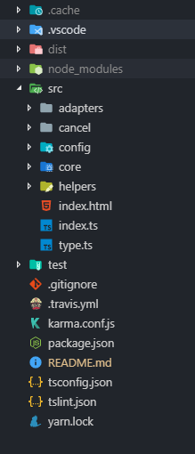

# TypeScript 重构 Axios 全攻略

又是一篇关于 TypeScript 的分享，年底了，请允许我沉淀一下。上次用 TypeScript [重构](https://juejin.im/post/5bf278295188252e89668ed2) Vconsole 埋下了对 Axios 源码解析的梗。于是，这次分享的主题就是 **如何用 TypeScript 重构 Axios 以及为什么我要这么做**。

笔者在用 TypeScript 重复造轮子的时候目的还是很明确的，**不仅是为了用 TypeScript 养成一种好的开发习惯，更重要的是了解工具库关联的基础知识。** 只有更多地注重基础知识，才能早日摆脱文档工程师的困扰。(Ps: 用 TypeScript，也是为了摆脱前端查文档的宿命!)

本次分享包括以下内容：

- 工程简介
- API 实现
- XHR，XHR，XHR
- HTTP，HTTP，HTTP
- 单元测试

## 工程简介

Axios 是什么?

> Promise based HTTP client for the browser and node.js

Axios 支持浏览器和 Node。这里主要讲解浏览器端的 XHR 实现，限于篇幅不会涉及 node 下的 http 。来一起探索吧，首先来看下目录。

### 目录说明

目录与 Axios 基本保持一致，core 是 `Axios` 类的核心代码。adapters 是 XHR 核心实现，Cancel 是与 取消请求相关的代码。helpers 用于放常用的工具函数。

打包工具选用的 [Parcel](https://parceljs.org/)，目的是零配置。
